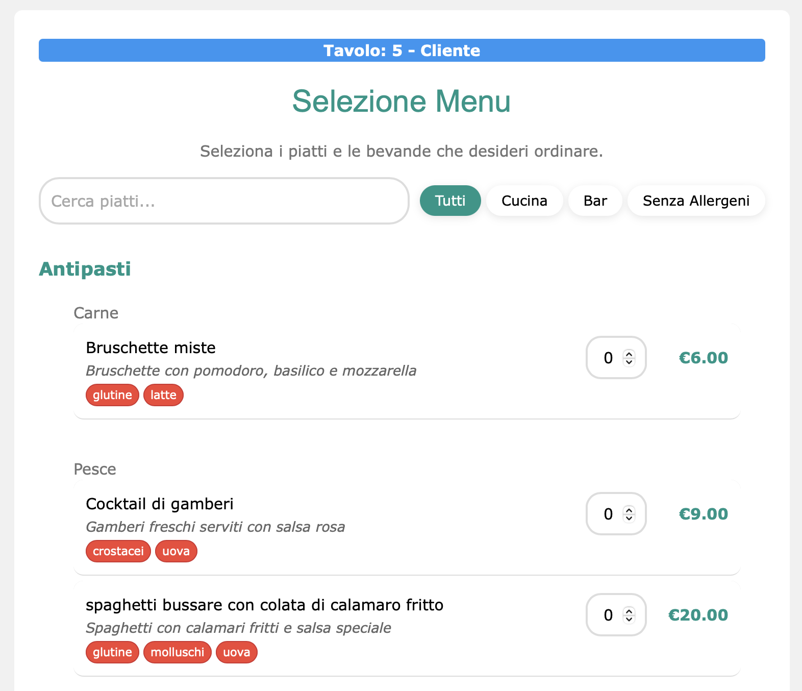
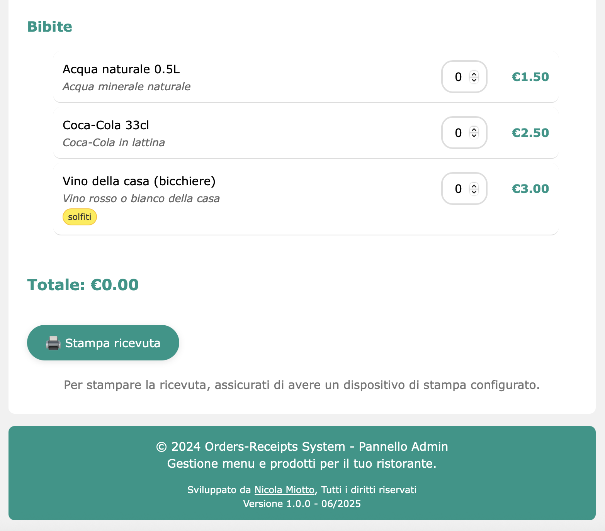
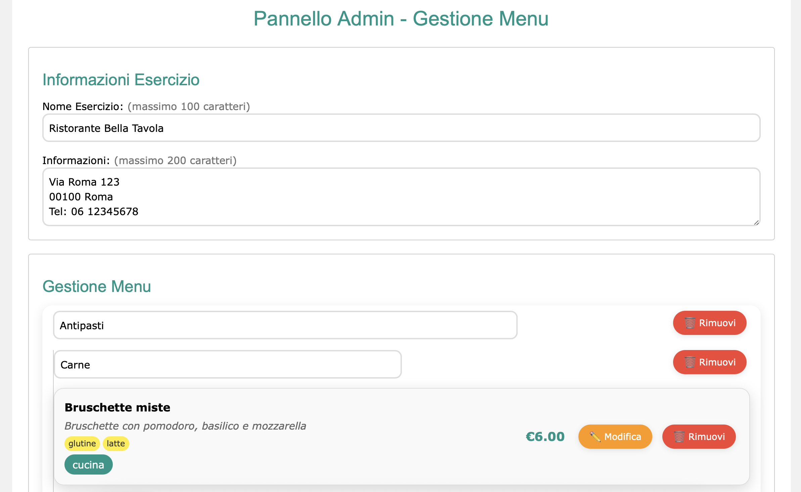
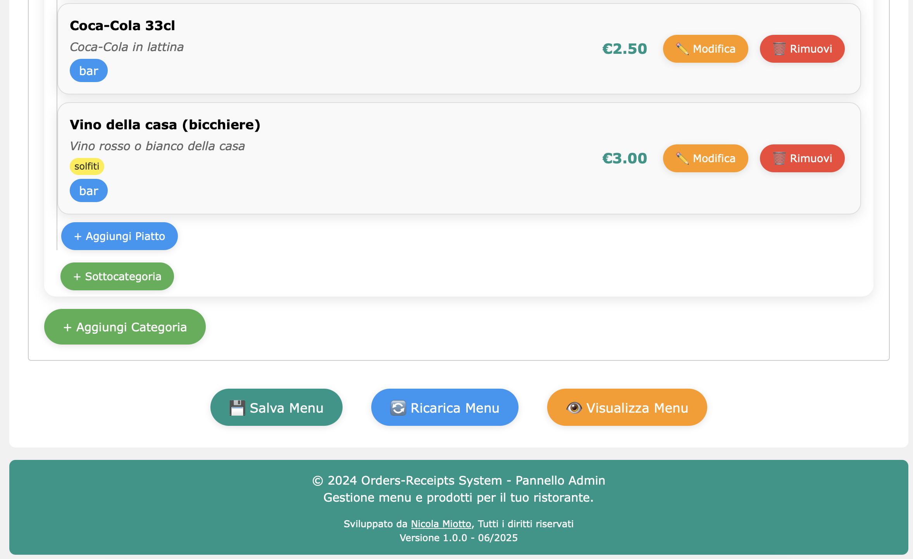

# 🍽️ Sistema Gestionale Ristorante

Un sistema completo per la gestione di menu, ordini e fatturazione per ristoranti con separazione cucina/bar.

## 📋 Caratteristiche Principali

### 📖 Gestione Menu
- **Editor visuale** per categorie e sottocategorie
- **Gestione prodotti** con nome, descrizione, prezzo e tipo (cucina/bar)
- **Sistema allergeni** con etichettatura automatica
- **Importazione/Esportazione** del menu in formato JSON

### 🍴 Sistema Ordini
- **Interfaccia touch-friendly** per presa ordini
- **Separazione automatica** ordini cucina e bar
- **Calcolo totali** in tempo reale
- **Gestione tavoli e clienti**
- **Stampa ricevute separate** per cucina e bar

## 🚀 Installazione e Configurazione

### Requisiti
- Browser web moderno (Chrome, Firefox, Safari, Edge)
- Server web locale (opzionale per sviluppo)

### Installazione
1. **Scarica** tutti i file del progetto
2. **Posiziona** i file in una cartella web-accessibile
3. **Apri** `index.html` nel browser per iniziare

### Struttura File
```
/
├── index.html                      # Pagina principale (redirect)
├── cucina_bar.html                 # Interfaccia presa ordini
├── gestione_menu.html              # Gestione menu e prenotazioni
├── data/
│   └── menu_data.json              # Database menu (JSON)
├── LICENSE                         # Licenza MIT
├── README.md                       # Documentazione completa
├── css/
│   ├── w3.css                      # Framework CSS W3.CSS
│   ├── styles.css                  # Stili principali
│   ├── menu.css                    # Stili interfaccia menu
│   └── admin.css                   # Stili interfaccia gestione menu
├── screenshots/                    # Cartella per screenshot
└── js/
    ├── menu.js                     # JS presa ordini
    └── admin.js                    # JS pannello admin
```

## 🎯 Utilizzo del Sistema

### 1. Configurazione Iniziale
1. **Apri** `gestione_menu.html`
2. **Configura** le informazioni del ristorante
3. **Crea** categorie e sottocategorie del menu
4. **Aggiungi** prodotti con prezzi e allergeni
5. **Salva** il menu

### 2. Presa Ordini
1. **Apri** `cucina_bar.html`
2. **Inserisci** numero tavolo e nome cliente
3. **Seleziona** prodotti e quantità
4. **Visualizza** il riepilogo ordine
5. **Stampa** le ricevute separate per cucina e bar

## ⚙️ Funzionalità Avanzate

### Sistema di Notifiche
- **Notifiche toast** per feedback utente
- **Colori differenziati** per tipo messaggio (successo, errore, warning, info)
- **Auto-dismiss** configurabile

### Modal Interattivi
- **Conferma ordini** con riepilogo dettagliato
- **Gestione prodotti** con form completo
- **Dettagli ordini** con separazione cucina/bar

### Ricerca e Filtri
- **Ricerca prodotti** per nome e descrizione
- **Filtri per tipo** (tutti, cucina, bar)
- **Filtro allergeni** per prodotti senza allergeni

### Responsive Design
- **Ottimizzato** per tablet e dispositivi touch
- **Layout adattivo** per diverse risoluzioni
- **Interfaccia intuitiva** per uso in cucina

## 🔧 Personalizzazione

### Temi e Colori
Modifica i colori in `css/styles.css`:
```css
:root {
    --primary-color: #009688;    /* Teal */
    --secondary-color: #4caf50;  /* Green */
    --accent-color: #ff9800;     /* Orange */
}
```

### Allergeni Personalizzati
Aggiungi nuovi allergeni in `gestione_menu.html` e `js/admin.js`:
```html
<div class="allergene-checkbox">
    <input type="checkbox" id="nuovo_allergene" value="nuovo allergene">
    <label for="nuovo_allergene">Nuovo Allergene</label>
</div>
```

### Valute e Formattazione
Modifica la formattazione prezzi in `js/menu.js`:
```javascript
const formatPrice = (price) => `€${price.toFixed(2)}`;
```

## 📊 Dati e Storage

### LocalStorage
Il sistema utilizza il **localStorage** del browser per:
- **Ordini salvati** (`ordini`)
- **Configurazioni** temporanee

### File JSON
- **menu_data.json**: Database principale del menu
- **Backup automatico**: Raccomandato backup periodico

### Esportazione Dati
```javascript
// Esporta ordini
const ordini = JSON.parse(localStorage.getItem('ordini') || '[]');
```

## 🔒 Sicurezza e Privacy

### Dati Locali
- **Nessun server esterno** richiesto
- **Dati memorizzati localmente** nel browser
- **Privacy completa** delle informazioni clienti

### Backup Consigliati
- **Backup menu_data.json** regolarmente
- **Backup localStorage** per dati ordini

## 🛠️ Risoluzione Problemi

### Menu Non Carica
1. Verifica presenza `menu_data.json`
2. Controlla console browser (F12) per errori
3. Ricrea il menu da pannello admin

### Stampa Non Funziona
1. Verifica impostazioni browser per stampa
2. Controlla popup blocker
3. Usa Ctrl+P come fallback

### Dati Persi
1. Controlla localStorage browser
2. Ripristina da backup menu_data.json
3. Ricrea configurazione da admin

### Prestazioni Lente
1. Cancella cache browser
2. Riduci numero prodotti visualizzati
3. Ottimizza immagini se presenti

## 📞 Supporto e Sviluppo

### Sviluppatore
- **Nome**: Nicola Miotto
- **GitHub**: [@MiottoNicola](https://github.com/MiottoNicola)
- **Versione**: 1.0.0 (06/2025)

### Tecnologie Utilizzate
- **HTML5** - Struttura pagine
- **CSS3** - Styling e responsive design
- **JavaScript ES6+** - Logica applicazione
- **W3.CSS** - Framework CSS
- **LocalStorage API** - Persistenza dati

### Licenza
Questo progetto è rilasciato sotto la **Licenza MIT**.

Vedi il file [LICENSE](LICENSE) per i dettagli completi.

#### Riassunto Licenza MIT:
- ✅ **Uso commerciale** permesso
- ✅ **Modifica** permessa
- ✅ **Distribuzione** permessa
- ✅ **Uso privato** permesso
- ❗ **Responsabilità limitata** dell'autore
- ❗ **Nessuna garanzia** fornita

### Contribuire
Per segnalazioni bug o richieste di funzionalità:
1. Crea issue su GitHub
2. Descrivi il problema dettagliatamente
3. Includi screenshot se necessario

## 🎨 Screenshots

### Interfaccia Presa Ordini




### Interfaccia Gestione Menu




---

**Sistema Gestionale Ristorante** - La soluzione completa per la gestione del tuo locale! 🍽️✨
